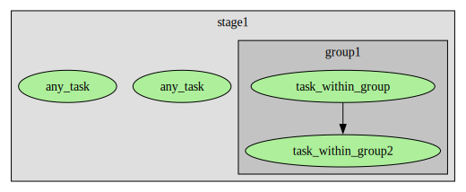

# DAG Visualization and Grouping Tasks/Stages

This [example](../examples.md) how to group tasks and stages within the visualization of the pipeline. Grouping may also be used
as a way to ensure some tasks to be executed before/after others even if they don't have an explicit dependency.

This is a simple flow [visualization](https://kroki.io/graphviz/svg/eNqljk1LxDAQQO_5FUO8rtjUk5R4XdnjXhcJkyZtw45JyQeyiP_dbsOCyiKoOc7kvTfGjRHnCbbwxvrwMofijcyx2I6louuup5KyjSqplHG0Yvmqxz5QiJLfNOtrG96xOtKE_bFjQ_D5y4BQW5LVsMjziaxMgZz5VOKXlFfz7knst8N0F4Lk_ymOMZT5e1HAYXBEFyUaOzxovoGKZExH9ery5Lxa8Q1Ump8ha_hzx9rfGdorinfGmh8t6E_qbLrC3v8VXKICbh-hBTjQZNHI5TTK6EiKdf0Bc8SyVQ==
) example with a group:
```python
        with Flow() as flow:
            with Stage("stage1"):
                _ = any_task()
                with GroupNode("group1"):
                    task1 = task_within_group()
                    _ = task_within_group2(task1)
                _ = any_task()
```



You can also use the group to order tasks within a stage with `ordering_barrier=True` parameter:
```python
        with Flow() as flow:
            with Stage("stage1"):
                _ = any_task()
                with GroupNode("group1", ordering_barrier=True):
                    task1 = task_within_group()
                    _ = task_within_group2(task1)
                _ = any_task()
```

In this [visualization](https://kroki.io/graphviz/svg/eNqlkM1KxDAURvd5ihC3I9SUClLi1p2u1MUwhKRJ2zDXpOYHKeK72zZ0UJkRdLK8X875LleZzouhx3f4HTXuZXDJKhZ90jUKSeasgRSi9jzwEEWnr6avsmscOM_IRbE8WpAa5ZEE0exr1Dobvw1ASA0sGyZ5HEGz4MCoL01krbL8WV6Pr-mpvH94ZOScxs67NPxspHjbGoBVKZRubyTZ4IxEEfb8zcTeWL7gG5xpMkNakV2Nyr8Z6BHFB0LFrxZhRz6bjrDVf8Gl9PIWU4y30Guh2KmjT7IoDLBiN99rQsoDUq4ZXbPqkFVrdsq7LPEJVE7SIQ==) 
case, the tasks outside the group are linked with the group:


The group style can be configured quite flexibly with passing a [](VisualizationStyle) parameter:
```python
        with Flow() as flow:
            with Stage("stage1"):
                _ = any_task()
                with GroupNode(
                        "group1", ordering_barrier=True, 
                        style=VisualizationStyle(hide_content=True, box_always_color="#ccccff")
                ):
                    task1 = task_within_group()
                    _ = task_within_group2(task1)
                _ = any_task()
```

In this [visualization](https://kroki.io/graphviz/svg/eNqdjr1qAzEQhHs9hVBaB2TDFUEoRcCkSuEuYMKx-jsfXp8OaVWYkHePYnGGS7psOTvzzbhxSDCf-Cv_ZDZe5lgmpykVr1gupv0slkw-9bnPBIPfVqsZbMSYtHiQt9tJoViTDII9KxbiRCsBwXjUjVDhdEWvc8TRKSb5MYyICxKcD09GbHiLwHTtCfJ5w1tI_Hi9Ex-KiX08EMmXd7i8abGm2Hoh3ClDimXeLoyGqITuv9VfrM5-fOa_JvAjnjw4vZYrj2BELf9urojunuoW49p0q_sGUUyLZw==)
case, the content of the group is hidden and the color of the box is chosen explicitly:


The box of groups can be hidden. In case of ordering_barrier=True, barrier tasks are added in [visualization](https://kroki.io/graphviz/svg/eNqdkcFqxCAQhu8-hdjDXrYlmuRQgj0USh9iKcFEk8hOY1BDG0rfva6SQCFs2Xr0m_mc-ZW6t2Ia8Cv-Qq15n8w8Su7trCrk5iaxFmbnla1d7bzoFQ2lTd8aMJaTuywelpEKpasGRHuuUGdG_-sCRKOAJ0OQ-wUUdwa0rFCGT50GWJVCqu6xIUecWsS41F648xGnJnKpVZK8VYhebSQvo7cLfhbWamXxIb390FszT_RAdnzsqu8yRP2h_aDHOkp2DPltBrajKP5Y6lP7W3Yq_xvuNwofc_-EKcYnGJSQnIYuLzTwLGYfGNsYWxmNOQaWbyxfGYsJBVZsrFhZHlcPrNxYubIijvMDyLDdyA==) 
instead:
```python
        with Flow() as flow:
            with Stage("stage1"):
                _ = any_task()
                with GroupNode("group1", ordering_barrier=True, style=VisualizationStyle(hide_box=True)):
                    task1 = task_within_group()
                    _ = task_within_group2(task1)
                _ = any_task()
```


Groups can also span stages like [this](https://kroki.io/graphviz/svg/eNqlj0tLxDAUhff5FSGzHTGpKylxKy6FAReDhLzaxrmTlDyQIv5324YBHUZB5nJX93LOd45xfZTjgB_xB9LhOIbiDc-x2BalouqPaCgp2yi8uJ3C8flt9yRfNCezRPU6QIicbOg6DSUtqicFUh9a1AWffxxAKgu8j6GMbIbkCSxPAZz5RjwBk0hZ9pZdQ6oOZySK950DOFlKY7t7Rba4SrJMB_Hu8uC8WINucVWTRWQNeW0R-59Dc8HiEy37W-nm6tLNWem7PyNLP4kl9uWgFN88YIbxHgYrDWezKksHnK7vL3uhxHM=):
```python
        with Flow() as flow:
            with GroupNode("group1"):
                with Stage("stage1"):
                    task1 = task_within_group()
                    _ = task_within_group2(task1)
            with Stage("stage2"):
                _ = any_task()
```


And it is possible to setup [visualization](https://kroki.io/graphviz/svg/eNqlkDtPwzAUhXf_Cut27eBEZagsD0yRWOjGgFDkZ4h6iSM_JALiv2NqAmolFnp1p_v4js4x4xDk_Ew7-k60f5l9noxIIVtOYlZ1pzHHZEMf-5jkYJtyqgbt0QcBG3aqlgEndaRQ6iMnzk_pbIBSWRSVUOBpQSuix9FwwuijGxFXpDTW7RVsaX2R09InGY9bWp_g69YaeOIEhsMdZtMt9zMTcE7RpZz7oUAXfJ5pAyumUgrkg_xahdXr1L_eNPvbhwN7i76gr7D8rdzCheu_8m2vzre9UNr9N98Szak_AXtNuF8=)
groups within configuration:

```python
        with Flow() as flow:
            with Stage("stage1"):
                _ = any_task()
                task1 = task_within_group()
                _ = task_within_group2(task1)
            with Stage("stage2"):
                _ = any_task()
```

```yaml
instances:
    __any__:
        visualization:
            default:
                styles:
                    my_group_style:
                        hide_content: true
                        box_color_always: "#ccccff"
                group_nodes:
                    my_group1:
                        label: "Group 1"
                        tasks: 
                          - task_within_group
                          - task_within_group2
                        style_tag: my_group_style
                    my_group2:
                        label: "Group 2"
                        stages:
                            - stage2
```

For testing, it might be easier to assemble the configuration in code:
```python
        from pydiverse.pipedag.core.config import create_basic_pipedag_config, PipedagConfig
        base_cfg = create_basic_pipedag_config(
            f"duckdb:///{temp_dir}/db.duckdb",
            disable_stage_locking=True,  # This is special for duckdb
            # Attention: If uncommented, stage and task names might be sent to the
            #   following URL. You can self-host kroki if you like:
            #   https://docs.kroki.io/kroki/setup/install/
            kroki_url="https://kroki.io",
        )
        group_nodes = dict(
            my_group1=dict(tasks=["task_within_group", "task_within_group2"], label="Group 1", style_tag="my_group_style"),
            my_group2=dict(stages=["stage2"], label="Group 2"),
        )
        styles = dict(
            my_group_style=dict(hide_content=True, box_color_always="#ccccff"),
        )
        visualization = dict(default=dict(group_nodes=group_nodes, styles=styles), alternative={})
        raw_cfg = base_cfg.raw_config.copy()
        raw_cfg["instances"]["__any__"]["visualization"] = visualization
        cfg = PipedagConfig(raw_cfg).get()
```


Here is a legend of default [colors](https://kroki.io/graphviz/svg/eNqlkl1LwzAUhu_7K0K9dEI_VnGUeuFQN-Z0iLvQISXNR9stS0qbDobsv5uubqXZB8hyeZL3Oc_hBKdxDrMEPIMfA4llJkqOA5mXxDeKMqrvECsLSfKwCAsJY2Krp1GMBBN5YF5Z2-NYpm_UpYhBtPANKrhsFRiMCAtqgoLLNSNBIViKfcMCM5oytkNCTGgvMjugjlRajEiCw6iUIYIoIWHKV1BFO6DmmFWcYPPbN-w2i9xRim4b1jZ9KrsxTg7tXDy0ow3ttkUp7Xou3ItSmCqp_zm6Fzu6mqOnO1Zn71gs0iw7KmmmS3u0-ugNrQcrMM9uN85FmYVccBIeWU6NrIh0YDu4P3Y-ralORJBSSDUi5OvzQJ70n6avbjGOH3Wg9mn-gIydB04mA_72_lUu5mMdqC23MWyvuWFdw-Rl3h1ZK294yGotoZHT1rGHqR_jgpt74AEwYwmBOPBUWKrOgXvorR5q3XepdnmHaMe37X4B23d0HQ==)
used for tasks and group nodes:


The following code is a basis for testing the code snippets from above. 
It can also be executed as [jupyter notebook](https://github.com/pydiverse/pydiverse.pipedag/tree/main/docs/source/examples/group_and_visualize.ipynb)
when using an ipython kernel similar to running `conda env create` 
with this [environment.yml](environment.yml).

```python
from __future__ import annotations

import tempfile

from pydiverse.pipedag import Flow, Stage, materialize, GroupNode, VisualizationStyle
from pydiverse.pipedag.core.config import create_basic_pipedag_config
from pydiverse.pipedag.util.structlog import setup_logging


@materialize
def any_task():
    return 1

@materialize
def task_within_group():
    return 2

@materialize
def task_within_group2(input1: int):
    return input1 + 1


def main():
    with tempfile.TemporaryDirectory() as temp_dir:
        cfg = create_basic_pipedag_config(
            f"duckdb:///{temp_dir}/db.duckdb",
            disable_stage_locking=True,  # This is special for duckdb
            # Attention: stage and task names might be sent to the
            #   following URL. You can self-host kroki if you like:
            #   https://docs.kroki.io/kroki/setup/install/
            kroki_url="https://kroki.io",
        ).get("default")
        with cfg:
            with Flow() as flow:
                with Stage("stage1"):
                    _ = any_task()
                    with GroupNode(
                            "group1", ordering_barrier=True, 
                            style=VisualizationStyle(hide_content=True, box_color_always="#ccccff")
                    ):
                        task1 = task_within_group()
                        _ = task_within_group2(task1)
                    _ = any_task()

            # Run flow
            result = flow.run()
            assert result.successful
            
            # you can also visualize the flow explicitly:
            # kroki_url = result.visualize_url()
            # result.visualize()


if __name__ == "__main__":
    setup_logging()  # you can setup the logging and/or structlog libraries as you wish
    main()
```
For SQLAlchemy >= 2.0, you can use sa.Alias instead of sa.sql.expression.Alias.

This code was used for creating the legend of colors:
```python
from __future__ import annotations

import tempfile

from pydiverse.pipedag import Flow, GroupNode, Stage, VisualizationStyle, materialize
from pydiverse.pipedag.core.config import create_basic_pipedag_config
from pydiverse.pipedag.util.structlog import setup_logging


@materialize
def failed():
    assert False, "This task is supposed to fail"


@materialize(version=None)
def completed_but_cache_invalid():
    return 1


@materialize(version="1.0")
def cache_valid():
    return 2


@materialize(version="1.0")
def cache_valid2():
    return 3


@materialize
def skipped(out):
    return out + 1


def main():
    with tempfile.TemporaryDirectory() as temp_dir:
        cfg = create_basic_pipedag_config(
            f"duckdb:///{temp_dir}/db.duckdb",
            disable_stage_locking=True,  # This is special for duckdb
            # Attention: stage and task names might be sent to the
            #   following URL. You can self-host kroki if you like:
            #   https://docs.kroki.io/kroki/setup/install/
            kroki_url="https://kroki.io",
            fail_fast=False,
        ).get("default").evolve(swallow_exceptions=True)
        with cfg:
            with Flow() as flow:
                with Stage("stage1"):
                    _ = completed_but_cache_invalid()
                    _ = cache_valid()
                with Stage("stage2"):
                    out = failed()
                with Stage("stage3"):
                    _ = skipped(out)
                    with GroupNode("group_none_cache_valid", style=VisualizationStyle(hide_content=True)):
                        _ = completed_but_cache_invalid()
                    with GroupNode("group_any_cache_valid", style=VisualizationStyle(hide_content=True)):
                        _ = completed_but_cache_invalid()
                        _ = cache_valid()
                    with GroupNode("group_all_cache_valid", style=VisualizationStyle(hide_content=True)):
                        # avoid memoization (not counted as cache valid)
                        _ = cache_valid2()
                    with GroupNode("group_any_failed", style=VisualizationStyle(hide_content=True)):
                        _ = completed_but_cache_invalid()
                        out = failed()
                        _ = skipped(out)

            # Run flow
            result = flow.run()
            assert not result.successful

            # Run flow again for cache validity
            result = flow.run()
            assert not result.successful

            # you can also visualize the flow explicitly:
            # kroki_url = result.visualize_url()
            # result.visualize()

if __name__ == "__main__":
    setup_logging()  # you can setup the logging and/or structlog libraries as you wish
    main()
```