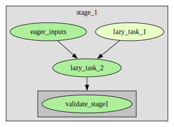

# Stage Validation

This [example](../examples.md) shows how to implement tasks that receive different versions of the tables in a stage. 
One application of this is to validate all tables created in a stage with the possibility to compare them against the
last successfully validated version of this stage (after schema swap). Another is to compare the tables against 
reference runs of another pipeline instance. For example the main branch might be automatically tested with running the
pipeline with one instance ID and all branches as well as interactive development might be tested with another instance 
ID (could also be other user in a per-user instance). In this case, it might be interesting to always compare the 
current development state against the most recent main branch run.

Here is an example how this might look like:

```python
from __future__ import annotations

import logging
import tempfile

import pandas as pd
import sqlalchemy as sa

from pydiverse.pipedag import Flow, Stage, Table, input_stage_versions, materialize
from pydiverse.pipedag.context import StageLockContext
from pydiverse.pipedag.core.config import create_basic_pipedag_config
from pydiverse.pipedag.util.structlog import setup_logging


# The @input_stage_versions decorator offers all the options that @materialize has as
# well. `input_type=sa.Table` may be a good choice for tests on larger tables.
@input_stage_versions(input_type=pd.DataFrame)
def validate_stage1(tbls: dict[str, pd.DataFrame], other_tbls: dict[str, pd.DataFrame]):
    # Any tests can be done on tables of both versions. They can either fail and prevent
    # the schema swap, print some information about differences, or produce a table
    # with results of validation.
    assert tbls["task_1_out"]["x"][0] == 1
    assert tbls["task_2_out"]["a"].sum() == 3
    tables = {t.lower() for t in tbls.keys() if not t.endswith("__copy")}
    assert len(tables - {"task_1_out", "task_2_out", "dfa"}) == 1
    assert list(tables - {"task_1_out", "task_2_out", "dfa"})[0].startswith("dfb_")
    logger = logging.getLogger(f"{__name__}-validate_stage1")
    logger.info("Additional tables: %s", set(tbls.keys()) - set(other_tbls.keys()))
    logger.info(
        "Missing tables: %s",
        set(other_tbls.keys()) - set(tbls.keys()) - {"column_diffs"},
    )

    # Producing a table with differences of matching table names can be done a lot more
    # elaborate in a library. Here is just an idea to get started:
    def get_missing_columns(tbl: pd.DataFrame, other_tbl: pd.DataFrame):
        return set(other_tbl.columns) - set(tbl.columns)

    missing_columns = {
        tbl: get_missing_columns(tbls[tbl], other_tbls[tbl])
        for tbl in set(tbls.keys()) & set(other_tbls.keys())
    }
    col_diff_dfs = [pd.DataFrame(dict(table=[], column=[], value=[]))]
    for tbl, columns in missing_columns.items():
        col_diff_df = pd.DataFrame(
            dict(
                table=tbl,
                column=list(columns),
                value="missing",
            )
        )
        col_diff_dfs.append(col_diff_df)
    col_diff_df = pd.concat(col_diff_dfs, ignore_index=True, axis="rows")
    return Table(col_diff_df, name="column_diffs")


@materialize(lazy=True)
def lazy_task_1():
    return Table(
        sa.select(
            sa.literal(1).label("x"),
            sa.literal(2).label("y"),
        ),
        name="task_1_out",
    )


@materialize(lazy=True, input_type=sa.Table)
def lazy_task_2(input1: sa.sql.expression.Alias, input2: sa.sql.expression.Alias):
    query = sa.select(
        (input1.c.x * 5).label("x5"),
        input2.c.a,
    ).select_from(input1.outerjoin(input2, input2.c.x == input1.c.x))

    return Table(query, name="task_2_out")


add_column = {"c": [1, 2, 3, 4]}


@materialize(nout=2)
def eager_inputs():
    dfA = pd.DataFrame(
        {
            "a": [0, 1, 2, 4],
            "b": [9, 8, 7, 6],
            **add_column,
        }
    )
    dfB = pd.DataFrame(
        {
            "a": [2, 1, 0, 1],
            "x": [1, 1, 2, 2],
        }
    )
    return Table(dfA, "dfA"), Table(dfB, "dfB_%%")


def main():
    logger = logging.getLogger(__name__)
    with tempfile.TemporaryDirectory() as temp_dir:
        cfg = create_basic_pipedag_config(
            f"duckdb:///{temp_dir}/db.duckdb",
            disable_stage_locking=True,  # This is special for duckdb
            # Attention: If uncommented, stage and task names might be sent to the
            #   following URL. You can self-host kroki if you like:
            #   https://docs.kroki.io/kroki/setup/install/
            # kroki_url="https://kroki.io",
        ).get("default")
        with cfg:
            with Flow() as f:
                with Stage("stage_1"):
                    lazy_1 = lazy_task_1()
                    a, b = eager_inputs()
                    lazy_2 = lazy_task_2(lazy_1, b)
                    col_diff = validate_stage1()

                _ = a, lazy_2  # unused terminal output tables

            # Run Flow a bit different first
            result = f.run()
            assert result.successful

            # change something in table dfa
            global add_column
            add_column = {}

            # Run Flow and print diff result
            with StageLockContext():
                result = f.run()
                assert result.successful
                logger.info(
                    "Column differences:\n%s",
                    result.get(col_diff, as_type=pd.DataFrame),
                )


if __name__ == "__main__":
    setup_logging()  # you can setup the logging and/or structlog libraries as you wish
    main()
```
For SQLAlchemy >= 2.0, you can use sa.Alias instead of sa.sql.expression.Alias.

Please note, that the validate_stage1 task is executed after all tasks in the stage that are called before it during 
flow wiring:



The output shows that the second run has the missing column "c" in table "dfa":
```
2024-05-07 08:33:25.413851 [info     ] Column differences:
  table column    value
0   dfa      c  missing [__main__]
```

It is also possible to use `@input_stage_versions` to compare against active schema of another pipeline instance. One 
needs to pass the ConfigContext object for this instance to the `@input_stage_versions` task during wiring.

```python
import sqlalchemy as sa
from pydiverse.pipedag import input_stage_versions, ConfigContext, PipedagConfig


@input_stage_versions(input_type=sa.Table)
def validate_stage1(tbls: dict[str, sa.Alias], other_tbls: dict[str, sa.Alias],
                    other_cfg: ConfigContext):
    # When accessing tables from other_tbls, in the most general case, one should do this by using other_cfg:
    # `dfs = {name:pd.read_sql_table(tbl, con=other_cfg.store.table_store.engine) for name, tbl in other_tbls.items()}`
    # It may be desirable to set up instances such the database can combine cross instance tables in one query. In case
    # of SQL Server, it is possible to reference tables cross database when using 
    # `sa.Table("name", sa.Metadata(), schema="<database>.<schama>")`. In other databases like postgres, one can run all
    # pipeline instances with the same database name but use schema_prefix="{instance_id}_" in the config.
    ...

def get_flow(other_cfg: ConfigContext):
    with Flow() as f:
        with Stage("stage_1"):
            lazy_1 = lazy_task_1()
            a, b = eager_inputs()
            lazy_2 = lazy_task_2(lazy_1, b)
            col_diff = validate_stage1(other_cfg)
    return f


def main():
    if __name__ == '__main__':
        other_cfg = PipedagConfig.default.get("main_branch")
    f = get_flow(other_cfg)
    result = f.run()
    assert result.successful
```

Sometimes it is easier to just handle a defined set of tables in an `@input_stage_versions` task. It does not matter 
how exactly you pass the tables. The task always receives all mentioned tables in the dictionaries known from above. 
Other inputs to the task passed during wiring are simply discared except for keyword arguments listed in pass_args 
parameter.
This works both with and without passing a config context of another pipeline instance.

```python
@input_stage_versions(input_type=sa.Table)
def cmp_tables1(tbls: dict[str, sa.Alias], other_tbls: dict[str, sa.Alias]):
    ...

@input_stage_versions(input_type=sa.Table, pass_args=["pass_arg"])
def cmp_tables2(tbls: dict[str, sa.Alias], other_tbls: dict[str, sa.Alias], pass_arg: str):
    ...

@input_stage_versions(input_type=sa.Table, pass_args=["pass_arg"])
def cmp_tables3(tbls: dict[str, sa.Alias], other_tbls: dict[str, sa.Alias],
                    other_cfg: ConfigContext, pass_arg: str):
    ...

def get_flow(other_cfg: ConfigContext):
    with Flow() as f:
        with Stage("stage_1"):
            lazy_1 = lazy_task_1()
            a, b = eager_inputs()
            lazy_2 = lazy_task_2(lazy_1, b)
            # there are many ways to call it like:
            compare_tables1(a, will_be_ignored_arg=1)
            compare_tables2(a, pass_arg="<str>", will_be_ignored_arg=1)
            compare_tables3(a, other_cfg, pass_arg="<str>")
            compare_tables1([a, lazy_1, b, lazy_2])
            compare_tables2({a, lazy_1, b, lazy_2}, pass_arg="<str>")
            compare_tables3({"a": a, "b": b}, pass_arg="<str>", cfg=other_cfg)
            compare_tables1({"a": a, "b": b, "others": [lazy_1, lazy_2])
    return f

```

Here is an example that uses `@input_stage_versions` for copying data between two pipeline instances:
[](/examples/multi_instance_pipeline)