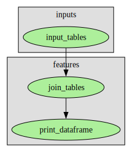

# pydiverse.pipedag

Pydiverse.pipedag is a data pipeline orchestration library designed to streamline the organization of code into stages,
ranging from data ingestion and transformations to model training and evaluation.
The library facilitates the interoperability of tasks written in various data transformation languages that can
serialize/deserialize tables to/from a relational database.

Currently, pipedag supports tasks written with pandas, polars, tidypolars, sqlalchemy, ibis, and pydiverse transform
code.
It simplifies the integration of existing code and eliminates boilerplate code, thus accelerating SQL table (de)
materialization, caching, and cache invalidation.

Refer to the [quickstart guide](/quickstart) for instructions on getting started.
Below is a simple example of a pipedag pipeline:

```python
# Define how the different tasks should be wired
with Flow() as flow:
    with Stage("inputs"):
        names, ages = input_tables()

    with Stage("features"):
        joined_table = join_tables(names, ages)
        print_dataframe(joined_table)

# Execute the flow
flow.run()
```

Graphical representations of the flow are generated automatically:


In the above example, each task like `join_tables()` can choose the format it prefers for table access.
Here, SQL Alchemy is used to generate a JOIN-SQL-Query from two table references:

```python
@materialize(lazy=True, input_type=sa.Table)
def join_tables(names: sa.Alias, ages: sa.Alias):
    return (
        sa.select(names.c.id, names.c.name, ages.c.age)
        .join_from(names, ages, names.c.id == ages.c.id)
    )
```

The same task can also be written using pandas:

```python
@materialize(version="1.0.0", input_type=pd.DataFrame)
def join_tables(names: pd.DataFrame, ages: pd.DataFrame):
    return names.merge(ages, on="id", how="inner")[["id", "name", "age"]]
```

Or handwritten SQL:

```python
def ref(table: sa.Alias):
    return f'"{table.original.schema}"."{table.original.name}"'

@materialize(lazy=True, input_type=sa.Table)
def join_tables(names: sa.Alias, ages: sa.Alias):
    sql = f"""
        SELECT names.id, names.name, ages.age
        FROM {ref(names)} AS names INNER JOIN {ref(ages)} ages ON names.id = ages.id
    """
    return sa.text(sql)
```

Or with pydiverse.transform:

```python
@materialize(lazy=True, input_type=pdt.SQLTableImpl)
def join_tables(names: pdt.Table, ages: pdt.Table):
    return (
            names
            >> join(ages, names.id == ages.id)
            >> select(names.id, names.name, ages.age)
    )
```

The main goal of pipedag is to enhance agility and iteration speed for teams developing data pipelines.
It offers several key features:

1. Easy embedding of existing data transformation, modeling, or model evaluation code into a pipedag flow.
2. Value-add out of the box, such as:
    - Simple setup of multiple pipeline instances with varying input data sizes.
    - Materialization of all tables in the database for easy inspection using explorative SQL queries.
    - Automatic caching and cache invalidation for improved speed.
3. Incremental improvement of data pipeline code, task by task, stage by stage.
4. Convenient unit and integration testing across multiple pipeline instances.
5. Stage transactionality concept ensures that a big input pipeline can be analyzed with explorative SQL at the same
   time as the pipeline is updated.
6. Pipeline runs can be triggered from IDE debugger, continuous integration framework, or pipeline orchestration UI
   without worrying about race conditions.

A realistic pipeline typically includes the following stages:

- Raw ingestion
- Cleaning for easier inspection (e.g., improving types for pandas.read_sql)
- Transformation into the best possible representation for economic reasoning
- Feature engineering (both stateless and stateful)
- Model training
- Model evaluation

To try it out, refer to the [quickstart guide](/quickstart).

Here, you can find more [examples](/examples).

## The Pydiverse Library Collection

Pydiverse is a collection of libraries for describing data transformations and data processing pipelines.

Pydiverse.pipedag is designed to encapsulate any form of data processing pipeline code, providing immediate benefits.
It simplifies the operation of multiple pipeline instances with varying input data sizes and enhances performance
through automatic caching and cache invalidation.
A key objective is to facilitate the iterative improvement of data pipeline code, task by task, stage by stage.

Pydiverse.transform is designed to provide a single syntax for data transformation code that can be executed reliably on
both in-memory dataframes and SQL databases.
The interoperability of tasks in pipedag allows transform to narrow its scope and concentrate on quality.
The results should be identical across different backends, and good error messages should be raised before sending a
query to a backend if a specific feature is not supported.

We are placing increased emphasis on simplifying unit and integration testing across multiple pipeline instances,
which may warrant a separate library called pydiverse.pipetest.

In line with our goal to develop data pipeline code on small input data pipeline instances,
generating test data from the full input data could be an area worth exploring.
This may lead to the creation of a separate library, pydiverse.testdata.

Check out the Pydiverse libraries on GitHub:

- [pydiverse.pipedag](https://github.com/pydiverse/pydiverse.pipedag/)
- [pydiverse.transform](https://github.com/pydiverse/pydiverse.transform/)

Check out the Pydiverse libraries on Read the Docs:

- [pydiverse.pipedag](https://pydiversepipedag.readthedocs.io/en/latest/)
- [pydiverse.transform](https://pydiversetransform.readthedocs.io/en/latest/)

## Concepts for future feature extensions

Pydiverse.pipedag has the aim to solve all data pipeline related common problems for typical econometric machine
learning modeling where flexibility and iteration speed matters most (rather than brute force performance in crunching
ever larger data amounts with the need to limit the communication pattern space). The target space would be 100GB to
100TB of unencrypted data and mostly focusing on 1-100 Mio row tables.

Pipedag will be most powerful when giving it control of cache invalidation of the whole data processing pipeline from
raw ingestion with filtering to various sample sizes (many pipeline instances) to model training and evaluation.
A few features are still missing so pipedag can handle this job in all envisioned cases:

1. In some cases, performance might not permit to materialize all tables in the databse. Thus, we envision a feature to
   mark a task output with an "inline" annotation (compare with the "inline" keyword in C++). In case two tasks can
   actually be connected directly (i.e via passing an Apache Arrow dataframe), the materialization of the intermediate
   step
   will be skipped. Per instance it should also be possible to control this behavior globally for the whole pipeline, so
   this optimization might only be used on the biggest pipeline instances due to performance and data storage
   constraints.
   In general, we like materialization of intermediate results since it massively speeds up debugging without the need
   for
   a debugger. Please note that we already have a feature called local table cache which can avoid some of the database
   to
   to python transfers.
2. Interactive debugging might currently not be as nice as it could be. The aim is that given the flow graph, you may
   ask for the input of any task and then interactively run the code within the task right up to materialization. We
   already have a feature to trigger materialization interactively when debugging inside a task. This breaks the flow
   execution since cache validation is infeasible in this scenario, but it greatly helps debugging materialization
   problems
   like duplicate keys or violation of database specific constraints like maximum row size.
3. Unit testing is an area we still want to greatly expand. It is probably worth another pydiverse library. The idea
   is that a unit test should be able to ask for any data within the graph of any pipeline instance. It can use that
   data
   for testing code that is best tested with real data. Additionally, it might specify what to do in case the data is
   not
   valid given the current code checkout/commit. We like to have a layer inside the pipeline that builds the best
   possible
   form for economic reasoning. This layer should be kept agile and not set in stone. Thus, any code working with this
   data
   layer should be heavily unit tested. Testing this code with real data often yields small tests that read their input
   from rather stable and big pipeline instances. Thus skipping such tests in case the big pipeline instance is cache
   invalid is the appropriate behavior. In other cases, making a dataset cache valid given the current code would be
   appropriate.
4. Currently, each pipeline instance has exactly one cache slot. When developing with multiple branches, it would still
   be nice to not generate infinite amounts of test-instances with complex space collection mechanisms. Instead, it is
   envisioned that a pipeline instance can have a defined number of cache slots. This would speed up tests when working
   with this many branches that modify the pipeline in early stages at the same time.
5. Pydiverse pipedag and pydiverse transform together form a way in which complex computation graphs can be managed in
   two complementing syntax styles. Transformation tools would have full access to the underlying computations and
   could convert them to other forms (like ONNX for example) in order to optimize execution performance, target specific
   hardware or make production deployments more robust.
6. Currently, pipedag supports the database backends Postgres, MSSQL/TSQL, and DB2 in a tested way that is used in
   real projects. Duckdb is supported for testing and demonstration purposes. Pipedag can be exteded by users. However,
   support for Snowflake, BigQuery, and common cloud scalabale databases with Postgres compatible SQL dialect are on the
   list to be supported out-of-the-box in the future. Parquet and in-memory apache arrow backed table backends
   are also likely to come.

## Related Work: Standing on the Shoulders of Giants

We deeply admire the clean library design achievements of [tidyverse](https://www.tidyverse.org/),
especially [dplyr](https://dplyr.tidyverse.org/).
We highly recommend reading the dplyr documentation to get a feel of how clean data wrangling can look like.
However, we currently see Python's open-source ecosystem surpassing the R programming language due to software
engineering considerations.
We believe that the data science and software engineering tool stacks need to merge, to achieve optimal results in data
analytics and machine learning.

While other popular tools like Airflow, while very impressive, go too far in taking care of execution,
making interactive development within IDE debuggers overly complex.

[Pandas](https://pandas.pydata.org/) and [Polars](https://www.pola.rs/) are currently contending for what is the best
dataframe processing library in Python.
We appreciate, use, and support both, but they cannot fully leverage the ingenious design of relational databases.
These databases are ideal for supporting high iteration speed algorithm development in early exploration phases and
disruptive improvements later on.
Most structural data pools, where flexible combination of any data source is key to success, are *not* Big Data.
Data pipelines usually do not require concurrent read and write operations on most tables
but rather rely on the constant-after-construction principle for transformed tables.
This simplifies the scaling of relational database performance and ensures that data pipeline output depends solely on
input data and processing code.
Hence, pipedag's emphasis on caching and cache invalidation.

Leaving all intermediate calculation steps of a data pipeline in the database is beneficial for analyzing problems and
potential improvements with explorative SQL queries.
However, handwritten SQL code is notoriously difficult to test and maintain.
As a result, we aim to simplify the incremental transition from handwritten SQL or dataframe code to programmatically
created SQL where better suited.
[SQL Alchemy](https://www.sqlalchemy.org/) is one of the most fundamental and comprehensive tools to do so, but it lacks
convenience.
[Ibis](https://ibis-project.org/) aims to offer a dplyr-like user interface for generating SQL and also tries to support
dataframe backends, but we find the current quality unsatisfactory.
It may also be challenging to significantly enhance the quality across the multitude of supported backends and the
ambition to support all SQL capabilities.

[Siuba](https://siuba.org/) was the starting point for pydiverse.transform, but its maturity level was not satisfactory.
On the dataframe side, there's a dplyr-like user interface: [tidypolars](https://github.com/markfairbanks/tidypolars).
It appears promising, but it has not always kept up with the latest Polars version.
We would love to use Ibis and tidypolars in areas where pydiverse transform is not yet up to the task or where we
intentionally limit the scope to ensure quality.

There are translation tools that help going from one data transformation language to multiple target backends,
such as [substrait](https://substrait.io/) and [data_algebra](https://github.com/WinVector/data_algebra),
that are far more ambitious than pydiverse.
While we follow their developments with excitement,
we are more convinced that we can ensure reliable operation for a defined set of backends, types, and scopes with
pydiverse.transform.
However, all these techniques are candidates for pydiverse.pipedag integration if users demand it.

The flow declaration syntax of pipedag was inspired by Prefect 1.x.
Even though they moved to a new syntax, we still support [Prefect](https://docs.prefect.io/latest/) as an execution
engine and pipeline orchestration UI.
Despite requiring the user to understand the difference between flow declaration time and task execution time, we prefer
the explicit declaration model in pipedag.
This model allows us to perform actions on the graph before executing anything, such as tapping into intermediate tables
with interactive code or running just individual tasks or stages.
We believe that the structure of data pipelines is relatively static in nature,
and the explicit declaration model helps to ensure this without needing to delve into implementation details.

When using handwritten SQL, [dbt](https://www.getdbt.com/) is a robust tool that shares some concepts with pydiverse
pipedag. Both tools allow users to provide a `SELECT` query and handle the materialization of the transformed data with
a `CREATE TABLE AS SELECT` query.

However, despite dbt's claim of Python support, Python is not in the driver's seat. Instead, Python processes are
initiated on demand to execute specific tasks. This complicates the reliable preparation of state-of-the-art Python
environments and their integration into the cache invalidation process. It also complicates the management of multiple
pipeline instances composed of both SQL parts and Python modeling code. This issue is a barrier to the gradual
transition to programmatically created SQL. Instead, most dbt users rely on Jinja templated SQL strings. Furthermore,
dbt does not natively support the concept of multiple pipeline instances.

For those using handwritten SQL, [dbt](https://www.getdbt.com/) is a mature tool sharing some concepts with
pydiverse.pipedag.
Both tools allow users to provide a `SELECT` query and take care of materializing the transformed data with
a `CREATE TABLE AS SELECT` query.
As a result, both tools can configure the data location separately from the transformation code,
and can detect whether a query needs to be re-executed based on input data and query changes (automatic cache
invalidation).
However, despite dbt's claim to support Python, Python is not in the driver's seat.
Instead, Python processes are started on demand to execute specific tasks.
This makes it harder to reliable preparation state-of-the-art Python environments and integrating into the cache
invalidation process.
It also complicates the management of multiple pipeline instances composed of both SQL parts and Python modeling code.
his is also a hurdle towards gradually moving to programmatically created SQL.
Most dbt users rely on Jinja templated SQL strings, and dbt does not natively support the concept of multiple pipeline
instances.

[//]: # (Contents of the Sidebar)

```{toctree}
:maxdepth: 2
:hidden:

quickstart
examples
table_backends
database_testing
best_practices
reference/config
reference/api
reference/cli
```

```{toctree}
:caption: Development
:hidden:

changelog
license
```