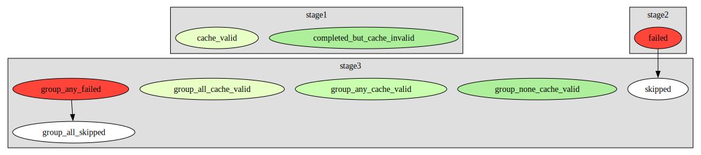

# Quickstart

## Installation

pydiverse.pipedag is distributed on [PyPi](https://pypi.org/project/pydiverse-pipedag/)
and [Conda-Forge](https://anaconda.org/conda-forge/pydiverse-pipedag).
To use it, just install it with pip or conda. We recommend also installing duckdb since it is used in example code:

```shell
pip install pydiverse-pipedag duckdb duckdb-engine
```

```shell
conda install pydiverse-pipedag duckdb duckdb-engine
```

## What is a Flow, a Task, and a Stage?

A flow is a collection of tasks. In the majority of cases, a task is a piece of code that receives some tables from the
database as input and produces one or more tables as output. Pipedag takes care of the reading and writing of tables
and thus the task can focus on the actual data transformation logic. Pipedag also allows that different tasks are
written with different styles of data transformation code. Examples are:

- RAW SQL: "CREATE TABLE AS SELECT 1 as a"
- Handwritten SQL: query = "SELECT 1 as a"
- SQLAlchemy: query = sa.select(sa.literal(1).label("a"))
- Ibis: query = ibis.literal(1).name("a")
- Pandas: df = pd.DataFrame({"a": [1]})
- Polars: df = pl.DataFrame({"a": [1]})

Tasks of different styles can be combined in the same flow because pipedag provides the input tables in the format that
the task expects. Tasks get defined using the {py:func}`@materialize <pydiverse.pipedag.materialize>` decorator.

Within a flow, tasks are grouped into stages. Stages are used to group tasks that are logically related to each other.  
Stages are typically represented by a schema in a database. New tables in such a schema will only be available in case
all tasks of a stage completed successfully. But don't worry, in case of an error, you will be able to look at the
partially written new schema, just under a different name.

## Running your first Flow

In the following example, we will create a very simple flow that
loads two data frames into the database, then uses SQL to join them,
and finally retrieves the joined table from the database as a data frame and prints it.

We'll start with defining the flow.
To do this, create a new python file (let's call it `quickstart.py`) inside an empty folder with the following content:

```python
import pandas as pd
import sqlalchemy as sa

from pydiverse.pipedag import Flow, Stage, materialize


# Define the different tasks our flow consists of
@materialize(version="1.0", nout=2)
def input_tables():
    names = pd.DataFrame({
        "id": [1, 2, 3],
        "name": ["Alice", "Bob", "Charlie"],
    })

    ages = pd.DataFrame({
        "id": [1, 2, 3],
        "age": [20, 40, 60],
    })

    return names, ages


@materialize(lazy=True, input_type=sa.Table)
def join_tables(names, ages):
    return (
        sa.select(names.c.id, names.c.name, ages.c.age)
        .join_from(names, ages, names.c.id == ages.c.id)
    )


@materialize(input_type=pd.DataFrame)
def print_dataframe(df):
    print(df)


def main():
    # Define how the different tasks should be wired
    with Flow("flow") as flow:
        with Stage("inputs"):
            names, ages = input_tables()

        with Stage("features"):
            joined_table = join_tables(names, ages)
            print_dataframe(joined_table)

    # # In case you provide a pipedag.yaml, you can run the flow as simple as:
    # flow.run()

    # run flow with a duckdb configuration in a random temporary directory (this is easier to get started)
    import tempfile
    from pydiverse.pipedag.core.config import create_basic_pipedag_config
    with tempfile.TemporaryDirectory() as temp_dir:
        cfg = create_basic_pipedag_config(
            f"duckdb:///{temp_dir}/db.duckdb",
            disable_stage_locking=True,  # This is special for duckdb
        ).get("default")
        # Execute the flow
        flow.run(config=cfg)


if __name__ == "__main__":
    from pydiverse.pipedag.util.structlog import setup_logging

    setup_logging()  # you can setup the logging and/or structlog libraries as you wish
    main()
```

If you now run the flow by running `python quickstart.py`, you should see a bunch of logging output.
This is completely normal.
Somewhere within all the log lines you should see the following lines getting printed:

```none
   id     name  age
0   1    Alice   20
1   2      Bob   40
2   3  Charlie   60
```

This means that everything went as expected.

If you like to connect to a running database, you can find another way of configuring pipedag [here](database_testing.md).

There are various ways to [visualize](/examples/group_and_visualize) your flow which will color encode which 
tasks ran, which ones failed, which ones were cache, valid, etc.:


Here is a legend of default colors:



Here, you can find more [examples](/examples).

### What is going on here?

## Declaration time vs. run time

It is important to understand that there is a difference between flow declaration time and flow run time.
We really like that the code that wires the tasks looks like it could be actual code that produces tables and passes
them on to other tasks. However, whenever a task function with {py:func}`@materialize <pydiverse.pipedag.materialize>`
decorator is called within a `with Flow() as flow:` statement, it does not actually run, and it does not actually
produce any tables. Just the wiring of tasks is recoded, so that flow.run() actually executes all tasks. Please note
that the tuple decomposition in `names, ages = input_tables()` already needs to happen at declaration time before the
return statement of `def input_tables()` is executed. Thus, the {py:func}`@materialize <pydiverse.pipedag.materialize>`
decorator has a parameter called `nout`, which must match the number of elements in which the task output should be
decomposable. Tasks can also return lists and dictionaries. get-item access executed on them on declaration time will
also just be recorded and lazily evaluated with consuming tasks.

## Materialization, dematerialization, and `input_type` parameter 

Please note the `input_type` parameter of the {py:func}`@materialize <pydiverse.pipedag.materialize>` decorator. It is 
used to specify the type in which the task likes to process tabular inputs. Pipedag takes care of reading the table from
the configured table store and to present it to the task in the requested form. The typical table store is a SQL 
database. Any tabular outputs of the task are written to the table store independent of its form. You can find a list
of supported input_type choices [here](/backend_types). 

## Automatic cache invalidation with `lazy=True`

For SQL tasks, a common input_type is `sqlalchemy.Table`. This would provide SQLAlchemy table references to input tables
which are already auto-loaded, so they would know about columns and column types of the respective table in the 
database. Ideally, this is combined with `lazy=True`. In this case, the task must produce a SQLAlchemy expression for
any tabular outputs without executing them. Pipedag can render the query and will only produce a table based on this
query expression if the query changed or one of the inputs to the task changed.

## Manual cache invalidation with `version` parameter

For non-SQL tasks, the `version` parameter of the {py:func}`@materialize <pydiverse.pipedag.materialize>` decorator must
be used for manual cache invalidation. As long as the version stays the same, it is assumed that the code of the task
did not materially change and will produce the same outputs given the same inputs. We refrained from automatically 
inspecting any python code changes since this would break at shared code changes where it is very hard to distinguish 
material changes. Not setting the version parameter for non-lazy tasks, will result in the task always being called 
without any cache validity checks.